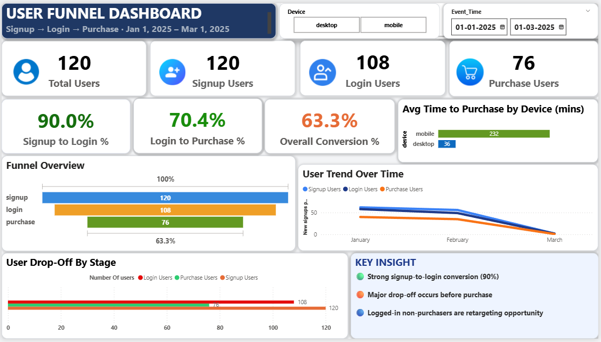

# 📊 User Funnel Analysis Dashboard
### Power BI · SQL · DAX · User Events Dataset · Jan–Mar 2025

---

> **Analysing 311 user events across 120 users to identify funnel drop-off, conversion rates, and actionable improvements using Power BI.**

---

## 🎯 Project Overview

This project analyses a real event-level user dataset of **311 events** across **120 unique users** from January to March 2025, tracking movement through a 3-stage product funnel:

**Signup → Login → Purchase**

The goal was to build a product analytics dashboard that answers real business questions:

- At which funnel stage are we losing the most users?
- What are the conversion rates at each stage?
- How does user activity trend over time?
- Is there a difference in conversion between Mobile and Desktop?

---

## 📈 Dashboard Screenshot



---

## 🛠️ Tools & Technologies

| Tool | Purpose |
|------|---------|
| **Power BI Desktop** | Dashboard design, visualisation, interactivity |
| **DAX** | KPI measures, funnel conversion, conditional formatting |
| **SQL (MySQL)** | Data preparation and funnel aggregation |
| **Excel / CSV** | Raw event dataset handling |

---

## 📁 Project Structure

```
user-funnel-analysis/
│
├── User_Funnel_Dashboard.pbix           ← Power BI dashboard file
├── User_Funnel_Analytics_Project.sql    ← SQL queries used for data prep
├── User_Events.csv                      ← Raw event dataset (311 records)
├── Dashboard_Screenshot.png             ← Full dashboard screenshot
└── README.md
```

---

## 📊 Dashboard Features

The dashboard is a single-page interactive report with 7 visuals and 2 slicers.

| Visual | Type | What it shows |
|--------|------|---------------|
| Total Users | KPI Card | 120 unique users |
| Signup Users | KPI Card | 120 users who signed up |
| Login Users | KPI Card | 108 users who logged in |
| Purchase Users | KPI Card | 76 users who purchased |
| Signup → Login % | Conversion Card | 90.0% — conditional formatting green |
| Login → Purchase % | Conversion Card | 70.4% — conditional formatting amber |
| Overall Conversion % | Conversion Card | 63.3% — conditional formatting amber |
| Funnel Overview | Bar Chart | Visual drop-off across all 3 stages |
| Drop-Off by Stage | Bar Chart | Absolute users lost at each stage |
| User Trend Over Time | Line Chart | Signup / Login / Purchase by month |
| Avg Time to Purchase | Bar Chart | Mobile vs Desktop purchase time |
| Key Insights | Text Panel | 4 data-driven business findings |

**Interactive filters:** Device slicer · Date Range slicer — all visuals update together.

---

## 📐 DAX Measures

```dax
Signup Users =
CALCULATE(DISTINCTCOUNT(user_events[user_id]),
          user_events[event_name] = "signup")

Login Users =
CALCULATE(DISTINCTCOUNT(user_events[user_id]),
          user_events[event_name] = "login")

Purchase Users =
CALCULATE(DISTINCTCOUNT(user_events[user_id]),
          user_events[event_name] = "purchase")

Signup to Login % =
DIVIDE([Login Users], [Signup Users])

Login to Purchase % =
DIVIDE([Purchase Users], [Login Users])

Overall Conversion % =
DIVIDE([Purchase Users], [Signup Users])

Funnel Leakage % =
1 - [Overall Conversion %]
```

---

## 🔍 Key Insights

These findings were derived from the dashboard analysis — not visible from the raw data alone:

1. **90% of users login after signup** — the onboarding flow is strong. Only 12 users out of 120 dropped off at this stage, meaning no urgent action is needed here.

2. **The critical bottleneck is Login → Purchase** — 32 logged-in users (29.6%) never completed a purchase. This is the highest-impact stage to fix and represents the largest revenue opportunity.

3. **Only 63.3% of users complete the full funnel** — 36.7% funnel leakage means more than 1 in 3 users who signed up never purchased. Recovering even half of these users significantly increases revenue.

4. **Mobile and Desktop convert at identical rates (63.3% each)** — the drop-off is not a device-specific UX problem. It is a checkout intent or friction issue affecting both platforms equally.

---

## 📈 Dataset Information

| Property | Detail |
|----------|--------|
| Dataset | User Funnel Event Dataset |
| Total Records | 311 events |
| Unique Users | 120 |
| Event Types | signup, login, purchase |
| Device Types | mobile, desktop |
| Time Period | January 2025 – March 2025 |
| Signup users | 120 |
| Login users | 108 |
| Purchase users | 76 |

---

## 🗄️ SQL Concepts Used

- `GROUP BY` with aggregate functions (`COUNT`, `MAX`)
- `CASE WHEN` for pivoting event types into columns
- `DISTINCT` user counts per funnel stage
- Common Table Expressions (CTEs) for multi-step funnel logic
- `JOIN` to combine signup, login, and purchase stages
- `RANK()` for device-wise conversion ranking
- Running totals using `SUM() OVER()`
- Top-N filtering for stage-level analysis

---

## 💡 Business Recommendations

The biggest drop-off is the **Login → Purchase** stage — 32 logged-in users never converted. These users showed intent by logging in, making them the highest-value retargeting segment.

**1. Reduce checkout friction**
Implement one-click or 2-step checkout to lower abandonment between login and purchase.

**2. Retarget logged-in non-purchasers**
Trigger an email or push notification within 24 hours of a login event with no subsequent purchase.

**3. A/B test the checkout flow**
Run a simplified checkout vs the current flow, targeting specifically the Login → Purchase conversion gap.

**4. Investigate the 10% who never logged in**
12 users signed up but never logged in at all. Check if email verification or onboarding steps are blocking them — fixing this is low effort, high reward.

**Projected impact:** Recovering 15 of the 32 dropped users at the purchase stage = 12.5% uplift in overall conversion rate.

---

## 👤 About

**Role Target:** Data Analyst · Product Analyst · Business Intelligence Analyst

**Skills demonstrated in this project:**
`Power BI` `DAX` `SQL` `Funnel Analytics` `Product Analytics` `KPI Development` `Conversion Optimisation` `Dashboard Storytelling` `User Behaviour Analysis`

---

## 📬 Contact

- LinkedIn: [your-linkedin-url]
- GitHub: https://github.com/Suru7971
- Email: surupawar7971@gmail.com

---

> ⭐ If you found this project useful, feel free to star the repository!
